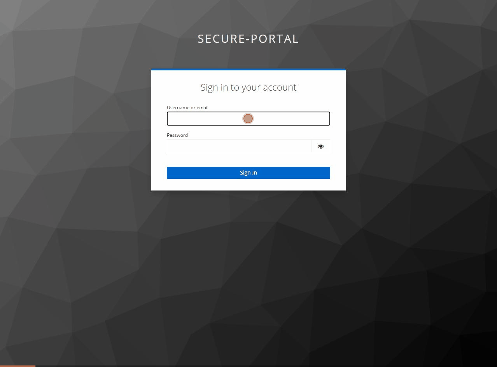

# Secure Portal — Keycloak SSO + RBAC Demo

A minimal but production-shaped example of enterprise authentication:
**React SPA + Node/Express API secured by Keycloak** (OpenID Connect), with
role-based access control enforced on the server and reflected in the UI.

Built as a demonstration of the auth patterns used in regulated-industry
platforms (pharma, finance): short-lived tokens, offline JWT verification,
server-side RBAC, and an append-only audit log.



## Architecture

```
┌─────────────┐  1. redirect to login   ┌──────────────┐
│  React SPA  │ ──────────────────────▶ │   Keycloak   │
│ (port 5173) │ ◀────────────────────── │  (port 8080) │
└──────┬──────┘  2. auth code + PKCE    └──────┬───────┘
       │            → tokens                   │
       │ 3. API calls with                     │ publishes public keys
       │    Authorization: Bearer <JWT>        │ (JWKS endpoint)
       ▼                                       ▼
┌─────────────┐  4. verifies JWT OFFLINE using cached JWKS keys
│  Node API   │     checks realm roles → 401 / 403 / 200
│ (port 4000) │  5. appends to audit log (who, what, when)
└─────────────┘
```

**Flow:** Authorization Code Flow with PKCE (no client secret in the browser).
Access tokens are short-lived; keycloak-js silently refreshes them.
The API never calls Keycloak per-request — it verifies token signatures
locally against Keycloak's published public keys (cached JWKS).

## Roles

| Role    | Can view runs | Can create runs | Can view audit log |
|---------|:---:|:---:|:---:|
| viewer  | ✅ | ❌ | ❌ |
| manager | ✅ | ✅ | ❌ |
| admin   | ✅ | ✅ | ✅ |

## Run it — one command

```bash
docker compose up -d --build
```

That's the entire stack: Keycloak (with realm, roles, and demo users
auto-imported), the API, and the SPA. First build takes a few minutes
(native-module compile); after that it's seconds.

<details>
<summary>Dev mode (hot reload) instead</summary>

```bash
docker compose up -d keycloak          # just the IdP
cd server && npm install && npm run dev    # http://localhost:4000
cd client && npm install && npm run dev    # http://localhost:5173
```
</details>

Open http://localhost:5173 and log in as:

| Username             | Password | Roles                  |
|----------------------|----------|------------------------|
| admin                | password | admin, manager, viewer |
| manager+001@kc.local | password | manager, viewer        |
| viewer+001@kc.local  | password | viewer                 |

**Try this:** log in as `viewer+001@kc.local`, then call the create-run endpoint
via curl with that token — you'll get a **403 with an audit log entry**. Hiding the
button is UX; the server is the security boundary.

## The 2-minute demo script

1. Log in as `viewer+001@kc.local` → only the runs table renders (role-aware UI).
2. Copy the Bearer token from DevTools → Network, and replay it against
   `POST /api/runs` via curl → **403 "Requires permission: runs:create"** —
   the server, not the UI, is the boundary.
3. Log out, log in as `admin` → **Load audit log** → the viewer's
   `ACCESS_DENIED` attempt is right there, persisted in SQLite.
4. Log out while keeping a copy of the admin token, then replay it —
   **401 "Session has been revoked"**: back-channel logout killed the
   still-unexpired token the instant the session ended.

## Token & session lifetimes

Set explicitly in `keycloak/realm-export.json` (rather than silent defaults):

| Setting | Value | Rationale |
|---|---|---|
| `accessTokenLifespan` | 5 min | The revocation-lag dial: tokens are verified offline, so a disabled user keeps access for at most this long. 5 min balances security vs refresh traffic. |
| `ssoSessionIdleTimeout` | 30 min | Walk-away protection: refresh stops working after 30 min of inactivity. |
| `ssoSessionMaxLifespan` | 8 h | Hard cap ≈ one working day: re-authenticate every morning, a norm in regulated environments. |

There is no separate refresh-token lifespan — a refresh token lives exactly as
long as the SSO session that issued it (idle/max above).

## Design decisions (the interview answers)

- **Why PKCE, no client secret?** A SPA cannot keep a secret — anything in the
  browser is public. PKCE binds the auth code to the client instance instead.
- **Why verify JWTs offline?** A per-request round trip to Keycloak would make
  it a bottleneck and single point of failure. Signature verification against
  cached JWKS keys costs microseconds. Tradeoff: revocation lag — mitigated by
  short token lifetimes (5 min) and **closed by back-channel logout**: when a
  session ends, Keycloak POSTs a signed logout token to the API, which
  blacklists the session id — so a still-unexpired token from a logged-out
  session is rejected immediately (`401 Session has been revoked` + audit).
- **Why validate the audience?** A signature check only proves Keycloak minted
  the token — not that it was minted for *this* API. Tokens must carry
  `secure-portal-api` in `aud` (stamped by a protocol mapper on the SPA
  client); valid tokens issued to other clients get 401.
- **401 vs 403:** 401 = "I don't know who you are" (missing/invalid token).
  403 = "I know exactly who you are, and no" (valid token, insufficient role).
- **Why audit ACCESS_DENIED events?** In regulated environments, failed access
  attempts are as important as successful ones — they're the security signal.
- **Roles vs permissions:** endpoints declare the *permission* they need
  (`runs:create`), never a role; `server/src/permissions.js` is the single
  place roles map to permissions. Granting or revoking a capability is a
  one-line config change — no route code touched. At larger scale that table
  moves to a database or a policy engine (OPA, Keycloak authorization
  services); the shape stays the same.

## Production hardening checklist (not in this demo)

- `start` (not `start-dev`) Keycloak behind TLS with a real database
- Confidential client + backend-for-frontend pattern for the most sensitive apps
- Rate limiting, security headers (helmet), CSP
- Token audience (`aud`) validation per-service
